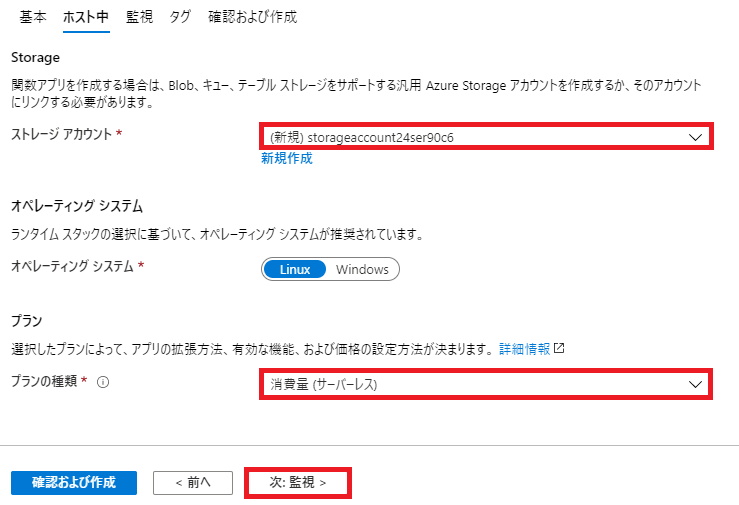
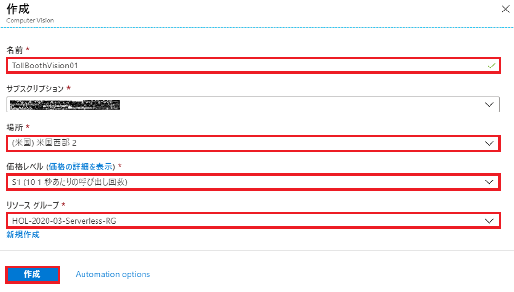
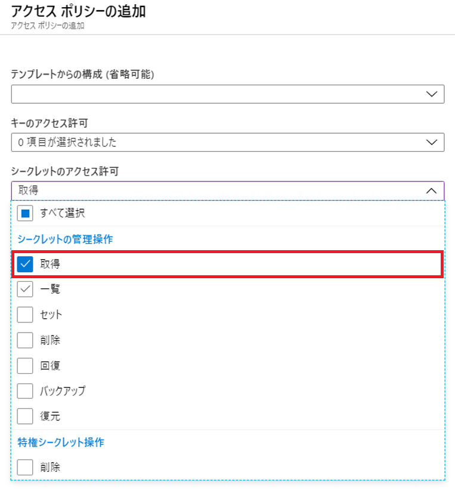
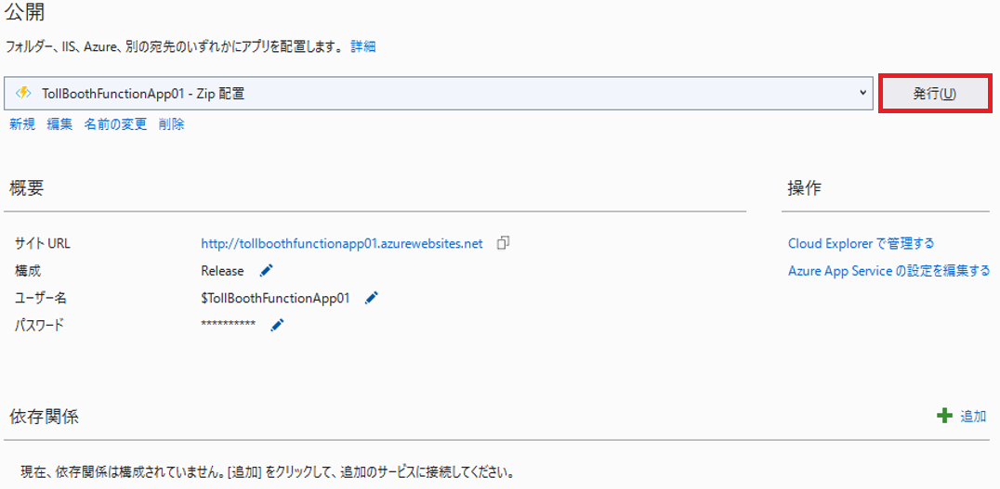
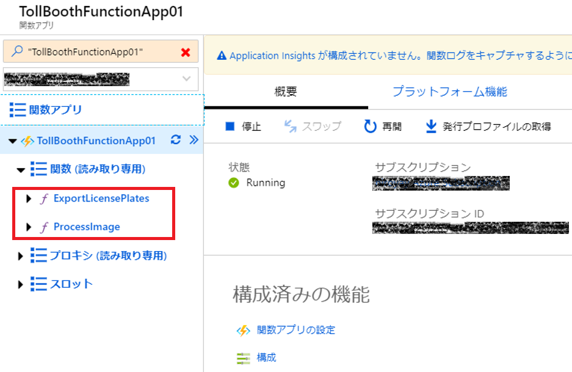
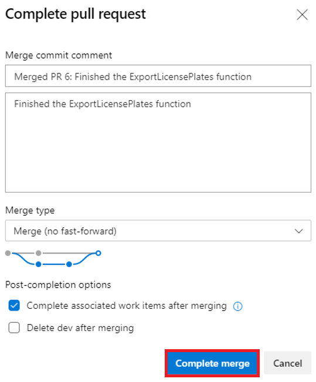
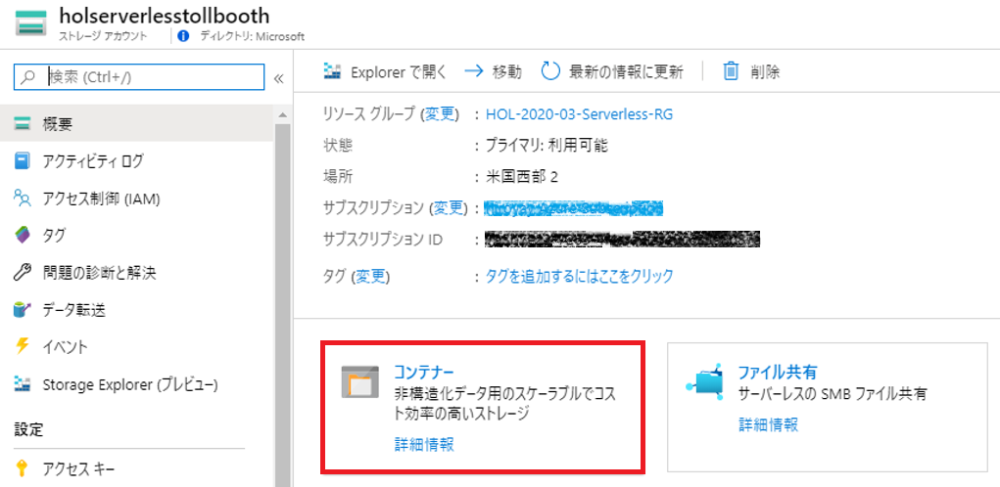

Serverless architecture  
Hands-on lab step-by-step  
February 2020

## Contents

<!-- TOC -->

- [Contents](#contents)
- [学習目標](#学習目標)
- [シナリオ](#シナリオ)
- [ソリューション アーキテクチャ](#ソリューション-アーキテクチャ)
- [必要条件](#必要条件)
- [Exercise 1: 環境のセットアップ](#exercise-1-環境のセットアップ)
    - [参考情報](#参考情報)
    - [Task 1: リソース グループの作成](#task-1-リソース-グループの作成)
    - [Task 2: リソース グループへのアクセス権限の付与](#task-2-リソース-グループへのアクセス権限の付与)
    - [Task 3: ストレージ アカウントのプロビジョニング](#task-3-ストレージ-アカウントのプロビジョニング)
    - [Task 4: Function Apps のプロビジョニング](#task-4-function-apps-のプロビジョニング)
    - [Task 5: Event Grid トピックのプロビジョニング](#task-5-event-grid-トピックのプロビジョニング)
    - [Task 6: Azure Cosmos DB アカウントのプロビジョニング](#task-6-azure-cosmos-db-アカウントのプロビジョニング)
    - [Task 7: Computer Vision API のプロビジョニング](#task-7-computer-vision-api-のプロビジョニング)
    - [Task 8: Azure Key Vault のプロビジョニング](#task-8-azure-key-vault-のプロビジョニング)
- [Exercise 2: 写真の処理を行う Azure Functions の開発と発行](#exercise-2-写真の処理を行う-azure-functions-の開発と発行)
    - [参考情報](#参考情報-1)
    - [Task 1: アプリケーション設定の構成](#task-1-アプリケーション設定の構成)
    - [Task 2: Key Vault へアクセスするためのシステム割り当てマネージド ID の生成](#task-2-key-vault-へアクセスするためのシステム割り当てマネージド-id-の生成)
    - [Task 3: Key Vault へのアクセス許可を付与するアクセス ポリシーの作成](#task-3-key-vault-へのアクセス許可を付与するアクセス-ポリシーの作成)
    - [Task 4: ProcessImage 関数の開発](#task-4-processimage-関数の開発)
    - [Task 5: Visual Studio から Function App の公開](#task-5-visual-studio-から-function-app-の公開)
- [Exercise 3: Azure ポータルでの Function App の開発](#exercise-3-azure-ポータルでの-function-app-の開発)
    - [参考情報](#参考情報-2)
    - [Task 1: ライセンス プレート データを Cosmos DB に保存する関数の作成](#task-1-ライセンス-プレート-データを-cosmos-db-に保存する関数の作成)
    - [Task 2: 関数への Event Grid サブスクリプションの追加](#task-2-関数への-event-grid-サブスクリプションの追加)
    - [Task 3: 関数への Cosmos DB 出力の追加](#task-3-関数への-cosmos-db-出力の追加)
    - [Task 4: run.csx へのコードの記述](#task-4-runcsx-へのコードの記述)
    - [Task 5: 手動検証データを Cosmos DB へ保存する関数の作成](#task-5-手動検証データを-cosmos-db-へ保存する関数の作成)
    - [Task 6: 関数への Event Grid サブスクリプションの追加](#task-6-関数への-event-grid-サブスクリプションの追加)
    - [Task 7: 関数への Cosmos DB 出力の追加](#task-7-関数への-cosmos-db-出力の追加)
    - [Task 8: run.csx へのコードの記述](#task-8-runcsx-へのコードの記述)
- [Exercise 4: Application Insights による Azure Functions の監視](#exercise-4-application-insights-による-azure-functions-の監視)
    - [参考情報](#参考情報-3)
    - [Task 1: Application Insights インスタンスのプロビジョニング](#task-1-application-insights-インスタンスのプロビジョニング)
    - [Task 2: Function App での Application Insights の有効化](#task-2-function-app-での-application-insights-の有効化)
    - [Task 3: ライブ メトリックス ストリーム を使用したリアルタイム監視](#task-3-ライブ-メトリックス-ストリーム-を使用したリアルタイム監視)
    - [Task 4: Azure Functions の動的スケーリングの監視](#task-4-azure-functions-の動的スケーリングの監視)
- [Exercise 5: Azure Cosmos DB 内のデータ探索](#exercise-5-azure-cosmos-db-内のデータ探索)
    - [参考情報](#参考情報-4)
    - [Task 1: Azure Cosmos DB データ エクスプローラーの使用](#task-1-azure-cosmos-db-データ-エクスプローラーの使用)
- [Exercise 6: データ エクスポート ワークフローの作成](#exercise-6-データ-エクスポート-ワークフローの作成)
    - [参考情報](#参考情報-5)
    - [Task 1: Logic App の作成](#task-1-logic-app-の作成)
- [Exercise 7: Function App の CI/CD 構成](#exercise-7-function-app-の-cicd-構成)
    - [参考情報](#参考情報-6)
    - [Task 1: Azure DevOps 組織とプロジェクトの作成](#task-1-azure-devops-組織とプロジェクトの作成)
        - [Azure DevOps 組織を新規作成する場合](#azure-devops-組織を新規作成する場合)
        - [既存の Azure DevOps 組織を使用し、プロジェクトを作成する場合](#既存の-azure-devops-組織を使用しプロジェクトを作成する場合)
    - [Task 2: プロジェクトへのユーザーの追加](#task-2-プロジェクトへのユーザーの追加)
    - [Task 3: Azure Repos へのソース コードの追加](#task-3-azure-repos-へのソース-コードの追加)
    - [Task 4: Azure Pipelines の作成](#task-4-azure-pipelines-の作成)
        - [リリース前の事前承認機能の追加](#リリース前の事前承認機能の追加)
        - [パイプラインの実行（ビルド＆リリース）](#パイプラインの実行ビルド＆リリース)
    - [Task 5: ブランチの作成と ExportLicensePlates 関数の変更](#task-5-ブランチの作成と-exportlicenseplates-関数の変更)
    - [Task 6: プルリクエストの作成](#task-6-プルリクエストの作成)
        - [プルリクエストの通知設定](#プルリクエストの通知設定)
        - [プルリクエストの作成](#プルリクエストの作成)
    - [Task 7: ブランチのマージと新バージョンの Azure への展開](#task-7-ブランチのマージと新バージョンの-azure-への展開)
- [Exercise 8: ワークフローの実行とエクスポート データの確認](#exercise-8-ワークフローの実行とエクスポート-データの確認)
    - [Task 1: Logic App の実行](#task-1-logic-app-の実行)
    - [Task 2: エクスポートされた CSV ファイルの表示](#task-2-エクスポートされた-csv-ファイルの表示)
- [ワークショップの終了](#ワークショップの終了)
    - [Task 1: リソース グループの削除](#task-1-リソース-グループの削除)
    - [Task 2: Azure DevOps プロジェクトの削除](#task-2-azure-devops-プロジェクトの削除)

<!-- /TOC -->

## 学習目標

このワークショップでは、Microsoft Azure Functions, Cosmos DB, EventGrid および関連サービスに基づく提供されたサンプルを使用し、エンド ツー エンドのシナリオを実装することを課題としています。このシナリオでは、コンピューティング、ストレージ、ワークフロー、および監視など Microsoft Azure の様々なコンポーネントを使用します。ワークショップは一人で実装できますが、他のメンバーとペアを組んで、各メンバーがソリューション全体の専門知識を共有できるようにすることをお勧めします。

ワークショップを最後まで実施することで、回復力、拡張性、およびコスト効率の高いサーバーレス ソリューションの設計、開発、監視を行うことができるようになります。

## シナリオ

Contoso 社では、高速道路などの料金所管理事業をより広いエリア向けに急速に拡大しています。
料金所管理事業は、彼らの主要ビジネスであるオンライン決済サービスとは異なるため、クラウド ストレージにアップロードされた車両の写真を使用して、多数の新しい料金所からナンバープレート情報を抽出するシステムのスケールアップに課題を抱えています。
現在はこの処理を手動で行っており、サードパーティーにバッチで画像ファイルを送信し、CSV ファイルへナンバープレート情報を抽出した後、Contoso 社に送り返してもらい、オンライン処理システムにアップロードしています。コスト効率と拡張性を備えた方法で、このプロセスを自動化したいと考えており、サーバーレスが最良の選択肢だと感じていますが、ソリューションを構築するための専門知識を持ち合わせておりません。

## ソリューション アーキテクチャ

このワークショップで構築するソリューション アーキテクチャの図を次に示します。


このソリューションは、車両の写真が **Azure Storage Blob** コンテナーにアップロードされたことを検知した時点から始まります。Blob Storage の作成イベントに対して **Event Grid** サブスクリプションが作成され、写真を処理する **Azure Functions** が呼び出され、写真が **Cognitive Services Computer Vision API OCR** サービスに送信されナンバープレート番号が抽出されます。処理が成功し、ナンバープレート番号が返された場合、この Azure Functions は、新しい Event Grid イベントとデータを "savePlateData" というイベント タイプで Event Grid のトピックに送信します。処理が失敗した場合は、"queuePlateForManualCheckup" というイベント タイプで Event Grid イベントをトピックに送信します。新しいイベントが Event Grid トピックに追加されたとき起動する２つの Azure Functions が構成され、各イベント タイプでのフィルター処理を行います。15 分間隔で実行される **Logic Apps** は、**Cosmos DB** から新しいナンバープレート番号を取得し、番号を CSV ファイルへエクスポートした後 Blob Storage に保存する Azure Functions を HTTP トリガーを使用して起動します。新しいナンバープレート番号が見つからなかった場合、Logic Apps は、電子メール通知を送信します。  
**Application Insights** は、データがサーバーレス アーキテクチャを通じて処理される際に、すべての Azure Functions をリアルタイムで監視するために使用します。このリアルタイム監視では、動的スケーリングを監視し、特定のイベントが発生した場合にアラートを構成できます。  
**Azure Key Vault**は、接続文字列や API へのアクセス キーなどのシークレットを安全に格納するために使用します。Key Vault では Azure Functions に割り当てられたマネージド ID に対してポリシーを通じてアクセス許可を付与します。

## 必要条件

- Microsoft Azure サブスクリプション
- ノート PC
  - Visual Studio 2019 (Community or Professional or Enterprise)
    - <https://www.visualstudio.com/vs/>
  - Azure 開発ワークロード
    - <https://docs.microsoft.com/azure/azure-functions/functions-develop-vs#prerequisites>
  - .NET Framework 4.7 以上のバージョンのランタイム
  - .NET Core 2.1 以上
  - メール アカウント(`Office 365` or `Gmail` or `Outlook.com`)

## Exercise 1: 環境のセットアップ

所要時間：30 分

ソリューション開発を行う前に Azure でいくつかのリソースをプロビジョニングします。  
クリーンアップを容易に行うために、すべてのリソースが同じリソース グループを使用するよう設定します。

この演習では、ホット層の Blob ストレージ アカウントをプロビジョニングし、アップロードされた写真と出力された CSV ファイルをそれぞれ保存するための２つのコンテナー（images, export）を作成します。次に２つの Function Apps プロビジョニングします。１つは Visual Studio からアプリをデプロイし、もう１つは Azure ポータルを使用して管理します。そして新しい Event Grid トピックを作成します。その後、２つのコレクション（Processed, NeedsManualReview）を持つ Azure Cosmos DB アカウントを作成します。最後に、ナンバープレートにオブジェクト文字認識（OCR）を適用するための新しい Cognitive Services Computer Vision API サービスをプロビジョニングします。  
Application Insights は、後の手順で追加しますので、Function Apps プロビジョニング時の Application Insights の設定は "無効" にしておいてください。

### 参考情報

- [ストレージ アカウントの作成 (blob ホット層)](https://docs.microsoft.com/azure/storage/common/storage-create-storage-account?toc=%2fazure%2fstorage%2fblobs%2ftoc.json%23create-a-storage-account)
- [Function App の作成](https://docs.microsoft.com/azure/azure-functions/functions-create-function-app-portal)
- [Event Grid の概念](https://docs.microsoft.com/azure/event-grid/concepts)
- [Cosmos アカウントの管理](https://docs.microsoft.com/azure/cosmos-db/manage-account)

### Task 1: リソース グループの作成

1. Web ブラウザーの新しいタブまたはインスタンスを起動し、Azure ポータル（<https://portal.azure.com>）を開く
2. 「**＋リソースの作成**」をクリックし、画面上部の検索ボックスに **resource** と入力  
   表示される候補から **Resource group** を選択

      

3. リソース グループの作成ブレードで「作成」ボタンをクリック
4. リソース グループ作成の「基本」ブレード内で、次の構成オプションを指定

   a. リソース グループ名（任意、サブスクリプション内で一意）  
   b. リージョン（任意、このワークショップで使用する地域）

   

5. 「**確認および作成**」をクリック
6. エラーがないことを確認し「**作成**」をクリックし、新しいリソース グループを作成

### Task 2: リソース グループへのアクセス権限の付与

1. 作成したリソースの管理ブレードへ移動
2. 「**アクセス制御 (IAM)**」をクリック

   

3. 「カスタム ロールを作成する」の「**追加**」をクリック

   

4. カスタム ロールの作成の「基本」ブレードで、次の構成オプションを指定

   a. カスタム ロール名（任意）
   b. ベースラインのアクセス許可（**ロールを複製します** を選択）
   c. 複製するロール（**共同作成者** を選択）

   

5. 「次へ」をクリック
6. 「アクセス許可」ブレードで割り当てられている許可/除外権限を確認  
「**次へ**」をクリック

   

7. 「割り当て可能なスコープ」ブレードで、現在のリソース グループが表示されていることを確認  
「**確認と作成**」をクリック

   

8. 「確認と作成」ブレードで「**作成**」をクリックし、プロビジョニングを開始
9. リソース グループの「アクセス制御 (IAM)」タブで「ロールの割り当てを追加する」の「**追加**」をクリック

   

0. 「ロール割り当ての追加」フォームで、次の構成オプションを指定

   a. 役割（上記手順で作成したカスタム ロールを選択）  
   b. 選択（権限を付与するユーザーを選択）

   

   >作成した役割が表示されるまで時間がかかる場合があります。  
   Azure AD 外のユーザーを追加する場合は、メールアドレスを入力してください。

   ※ Azure AD 外のユーザーの場合、下記の招待メールが届きます。

   

   「Get Started」をクリックすることで、組織へのアクセス権が付与

1. カスタム グループへ追加したユーザーで Azure ポータルを開く
2. 新しくリソース グループが追加できないことを確認

   

### Task 3: ストレージ アカウントのプロビジョニング

1. Azure ポータル（<https://portal.azure.com>）を開く
2. 「**＋リソースの作成**」をクリックし、「ストレージ」-「ストレージ アカウント」を選択

   

3. ストレージ アカウントの作成の「基本」ブレードで、次の構成オプションを指定

   a. リソース グループ（先の手順で作成したリソース グループを選択）  
   b. ストレージ アカウント名（任意：小文字と数字で 3 から 24 文字かつ一意の名前を入力）  
   c. 場所（リソース グループと同じ地域を指定）  
   d. パフォーマンス（**Standard** を選択）  
   e. アカウントの種類（**StorageV2** を選択）  
   f. レプリケーション（**ローカル冗長ストレージ (LRS)** を選択）  
   g. アクセス層（**ホット** を選択）

   

4. 「**確認および作成**」をクリック
5. エラーがないことを確認し「**作成**」をクリック
6. ストレージ アカウントのプロビジョニング完了後、「**リソースに移動**」をクリック

   

7. ストレージ アカウントのブレードでメニュー内の**アクセス キー**を選択し key 1 の<u>接続文字列</u>をコピー

   

8. ストレージ アカウントの管理ブレードが表示
9.  ストレージ アカウントの「Blob service」メニュー配下の「**コンテナー**」をクリック
10. 以下の構成オプションを指定し、２つのコンテナーを作成

   a. 名前（**images**, **export**）  
   b. パブリック アクセス レベル（**プライベート**）

   

   作成後の画面には以下のコンテナーのリストが表示

   

### Task 4: Function Apps のプロビジョニング

1. Azure ポータル（<https://portal.azure.com>）を開く
2. 「＋リソースの作成」をクリックし、画面上部の検索ボックスに **function** と入力  
   表示される候補から **Function App** を選択

      

3. 関数アプリの作成ブレードで「**作成**」ボタンをクリック
4. 関数アプリの「基本」ブレード内で、以下の構成オプションを指定

   a. リソース グループ（先の手順で作成したリソース グループを選択）  
   b. 関数アプリ名（名前は 2 文字以上かつ一意の名前で、例えば **TollBoothFunctionApp + {任意の文字列}** で作成）  
   c. 公開（**コード** を選択）  
   d. ランタイム スタック（**.NET Core** を選択）  
   e. 地域（リソース グループと同じ地域を指定）  
   

5. 「**次: ホスト中 >**」をクリック
6. 「ホスト中」ブレード内で、以下の構成オプションを指定

   a. ストレージ アカウント（新規作成）  
   b. オペレーティング システム（**Windows**）  
   c. プランの種類（**従量課金プラン**）  
   

7. 「**次: 監視 >**」をクリック
8. 「監視」ブレード内で「Application Insights を有効にする」を「**いいえ**」に設定

   

9. 「**確認および作成**」をクリック
10. 「**作成**」をクリック
11. 1-10 のステップを繰り返し、新しい Function App を<u>もう１つ</u>プロビジョニング

    （2 つ目の Function App の基本ブレードから例えば **TollBoothEvent + {任意の文字列}** の名前で作成）  
    

### Task 5: Event Grid トピックのプロビジョニング

1. Azure ポータル（<https://portal.azure.com>）を開く
2. 「**＋リソースの作成**」をクリックし、画面上部の検索ボックスに **event grid** と入力  
   表示される候補から **Event Grid Topic** を選択

      

3. Event Grid Topic ブレードで「**作成**」をクリック
4. 「トピックの作成」ブレード内で、以下の構成オプションを指定

   a. 名前（一意の名前）  
   b. リソース グループ（先の手順で作成したリソース グループを選択）  
   c. 場所（リソース グループと同じ地域を指定）  
   d. イベント スキーマ（**イベント グリッド スキーマ** を選択）

      

5. 「**作成**」をクリック
6. 作成完了後、リソースへ移動し「**概要**」から "トピック エンドポイント"をコピー

      

7. メニュー内の 「**アクセス キー**」を選択
8. アクセス キーのブレードから、Key 1 の値をコピー

      
   

9. 後ほど参照するためにノートパッドなどのエディタに貼り付けておく

### Task 6: Azure Cosmos DB アカウントのプロビジョニング

1. Azure ポータル（<https://portal.azure.com>）を開く
2. 「**＋リソースの作成**」をクリックし、「データベース」-「Azure Cosmos DB」を選択

   

3. 「Azure Cosmos DB アカウントの作成」の「基本」ブレードで、以下の構成オプションを指定
   a. リソース グループ（先の手順で作成したリソース グループを選択）  
   b. アカウント名（小文字、数字、'-' のみ、3 から 31 文字で一意の名前）  
   c. API（**コア (SQL)** を選択）  
   d. 場所（リソース グループと同じ地域を選択）  
   e. geo 冗長性（**無効**を選択）  
   f. マルチ リージョン書き込み（**無効**を選択）  
   e. Availability Zones（**無効**を選択）

   

4. 「**確認と作成**」をクリック
5. エラーがないことを確認し「**作成**」をクリック
6. Azure Cosmos DB アカウントのプロビジョニング完了後、「**リソースに移動**」をクリック

   

7. Azure Cosmos DB アカウントの管理ブレードが表示
8. メニューの「データ エクスプローラー」-「**New Container**」をクリック

   

9. 「Add Container」ブレードで、以下の構成オプションを指定

   a. Database Id（**Create new** / **LicensePlates**）  
   b. Provision database throuput(チェックを外す)  
   c. Container Id（**Processed**）  
   d. Partition Key（**licensePlateText**）  
   e. Throughput（**Manual** / **5000**）

      

10. 「**OK**」をクリック
11. 再度「**New Container**」をクリックし、新しいコンテナーを作成
12. 「Add Container」ブレードで、以下の構成オプションを指定

    a. Database Id（**Use existing** / **LicensePlates**）  
    b. Provision database throuput(チェックを外す)  
    c. Container Id（**NeedsManualReview**）  
    d. Partition Key（**fileName**）  
    e. Throughput（**Manual** / **5000**）

       

13. 「OK」をクリック

    作成後、データ エクスプローラーは以下の画面を表示

      

14. メニュー ブレードから、「**キー**」を選択
15. "読み取り/書き込みキー" の **URI** と**プライマリ キー**をコピー

      

16. 後ほど参照するためにノートパッドなどのエディタに貼り付けておく


### Task 7: Computer Vision API のプロビジョニング

1.  Azure ポータル（<https://portal.azure.com>）を開く
2.  「**＋リソースの作成**」をクリックし、画面上部の検索ボックスに **computer vision** と入力  
    表示される候補から **Computer Vision** を選択

       

3.  Computer Visoin ブレードで「**作成**」をクリック
4.  Computer Vision の「作成」ブレードで、以下の構成オプションを指定

    a. 名前（英数字と '-' のみで 2 から 64 文字で一意の名前を指定）  
    b. 場所（リソース グループと同じ地域を選択）  
    c. 価格レベル（**S1** を選択）  
    d. リソース グループ（先の手順で作成したリソース グループ）

       

5.  「**作成**」をクリック
6.  Computer Vision API 作成後、リソースへ移動し 「**概要**」から**エンドポイント**と **Key** をコピー

       


### Task 8: Azure Key Vault のプロビジョニング

1. Azure ポータル（<https://portal.azure.com>）を開く
2. 「＋リソースの作成」をクリックし、画面上部の検索ボックスに **key vault** と入力  
   表示される候補から **Key Vault** を選択

      

3. Key Vault ブレードで「**作成**」をクリック
4. キー コンテナーの作成の「基本」ブレードで、以下の構成オプションを指定

   a. リソース グループ（先の手順で作成したリソース グループを選択）  
   b. Key Vault 名（英数字と '-' のみで 3 から 24 文字で一意の名前を指定）  
   c. 地域（リソース グループと同じ地域を選択）  
   d. 論理的な削除（**無効化**）

      

5. 「**確認および作成**」をクリック
6. エラーがないことを確認し「**作成**」をクリック
7. 展開完了後、「**リソースに移動**」をクリック

   

8. キー コンテナーの管理ブレードが表示
9. メニューの「シークレット」-「**生成/インポート**」をクリック

   

   （シークレット作成画面）  
   

   シークレット作成時の名前と値のペアは以下の表を参考 (blobStorageConnection は Task 3. で作成したストレージ アカウントのものを記載)  
   各シークレットは名前と値の指定のみで、他のフィールドはデフォルト値のまま作成
   | | |
   |:--|:-:|
   |**Name**|**Value**|
   |computerVisionApiKey|Computer Vision API Key|
   |eventGridTopicKey|Event Grid Topic access Key|
   |cosmosDBAuthorizationKey| Cosmos DB Primary Key|
   |blobStorageConnection|Blob storage connection string|

   シークレット作成後の画面には以下のようなリストが表示される

   

## Exercise 2: 写真の処理を行う Azure Functions の開発と発行

所要時間：45 分

Visual Studio に統合された Azure Functions ツールを使用して、ローカル環境で関数を開発およびデバッグし、Azure に展開します。TollBooth ソリューションには、必要なコードのほとんどが含まれていますが、Azure に展開する前に不足しているコードを追加する必要があります。（コードを追加する箇所は TODO としてマークされています。）  
Visual Studio から Azure に展開する前に Azure ポータルで Function App にアプリケーション設定を構成します。誤ってセキュリティ情報が漏洩しないようにアプリケーション設定には、Cosmos DB の接続文字列や Comuputer Vision API の API Key を直接記述するのではなく、Key Vault シークレットの URI (シークレット識別子) を参照するように指定します。Function App が Key Vault にアクセスしてシークレットにアクセスできるように Function App へシステム割り当てマネージド ID を設定し、Key Vault 側にアクセス許可を与えるためのアクセス ポリシーを作成します。

> 注意：NuGet パッケージのバージョンは更新しないでください。  
> このソリューションは、現在定義されている NuGet パッケージのバージョンで動作するように構築されています。

### 参考情報

- [App Service と Azure Functions の Key Vault 参照を使用する](https://docs.microsoft.com/azure/app-service/app-service-key-vault-references)
- [App Service と Azure Functions でマネージド ID を使用する方法](https://docs.microsoft.com/azure/app-service/overview-managed-identity)
- [キー コンテナーへのアクセスをセキュリティで保護する](https://docs.microsoft.com/ja-jp/azure/key-vault/key-vault-secure-your-key-vault)
- [マネージド ID で Key Vault の認証を提供する](https://docs.microsoft.com/azure/key-vault/managed-identity)
- [Visual Studio を使用する Azure Functions の開発](https://docs.microsoft.com/azure/azure-functions/functions-develop-vs)
- [Azure Functions Core Tools の操作](https://docs.microsoft.com/azure/azure-functions/functions-run-local?tabs=windows)

### Task 1: アプリケーション設定の構成

1. Azure ポータル（<https://portal.azure.com>）を開く
2. 先の手順で作成したリソース グループへ移動し、TollBoothFunctionApp_ を選択  
   TollBoothFunctionApp_ の名前で作成していない場合は、どちらか片方を選択

      

3. 概要パネルの**構成**をクリック

   

4. **+新しいアプリケーション設定**をクリックし、以下のキー/値のペアを追加

   

   |名前|値|
   | :----------------------- | :---------------------------------------------------------------------------------------------------------------------------------------------------- |
   | computerVisionApiUrl     | `https://<YOUR-SERVICE-NAME>.cognitiveservices.azure.com/vision/v2.0/ocr` <br>Computer Vision API のエンドポイントに **vision/v2.0/ocr** を追加して指定|
   | computerVisionApiKey     | `@Microsoft.KeyVault(SecretUri=referenceString)`<br>referenceString に Key Vault の **computerVisionApiKey** シークレットの URI (シークレット識別子) を指定                |
   | eventGridTopicEndpoint   | Event Grid Topic のエンドポイント                                                                                                                     |
   | eventGridTopicKey        | `@Microsoft.KeyVault(SecretUri=referenceString)`<br>referenceString に Key Vault の **eventGridTopicKey** シークレットの URI (シークレット識別子) を指定                   |
   | cosmosDBEndPointUrl      | Cosmos DB URI                                                                                                                                         |
   | cosmosDBAuthorizationKey | `@Microsoft.KeyVault(SecretUri=referenceString)`<br>referenceString に Key Vault の **cosmosDBAuthorizationKey** シークレットの URI (シークレット識別子) を指定            |
   | cosmosDBDatabaseId       | **LicensePlates**（Cosmos DB データベース Id）                                                                                                        |
   | cosmosDBCollectionId     | **Processed**（Cosmos DB コレクション Id）                                                                                                            |
   | exportCsvContainerName   | **export**（Blob ストレージのコンテナー）                                                                                                             |
   | blobStorageConnection    | `@Microsoft.KeyVault(SecretUri=referenceString)`<br>referenceString に Key Vault の **blobStorageConnection** シークレットの URI (シークレット識別子) を指定               |

   \*エンドポイントや API KEY, 接続文字列は各リソースの管理ブレードから取得  
   （例：Computer Vision API のエンドポイントとキーの取得）

   

   \*アプリケーション設定の入力画面

   

   \* Key Vault のシークレット URI は、対象 Key Vault の「シークレット」から目的のシークレットを選択して確認

   
   

5. 「**保存**」をクリック

   

### Task 2: Key Vault へアクセスするためのシステム割り当てマネージド ID の生成

1. Function App の管理ブレードで「プラットフォーム機能」を開く
2. **ID** を開く

   

3. 「システム割り当て済み」タブで「状態」を**オン**に設定し、「**保存**」をクリック

   

4. 「システム割り当てマネージド ID を有効化する」のメッセージが表示されるので「**はい**」をクリック

### Task 3: Key Vault へのアクセス許可を付与するアクセス ポリシーの作成

1. Key Vault の管理ブレードで「アクセス ポリシー」を開く
2. 「**アクセス ポリシーの追加**」をクリック

   

3. 「アクセス ポリシーの追加」フォームで「**プリンシパルの選択**」をクリック

   

4. プリンシパル ブレードで先の手順で登録したサービス プリンシパルを検索し選択

   

5. 「アクセス ポリシーの追加」フォームに戻り「**シークレットのアクセス許可**」の「**取得**」を選択

   

6. 「**追加**」をクリックし

   

7. 「**保存**」をクリックし、これまでの設定を確定

   

### Task 4: ProcessImage 関数の開発

1. Visual Studio で「**TollBooth**」プロジェクトを開く
2. 「表示」メニューの「**タスク一覧**」を選択

   

3. TODO タスクの一覧を表示（各タスクは追加するコードの位置を示します。）

   

4. TODO 1 をダブルクリックし、**ProcessImage.cs** のコードを追加する箇所を表示

   > "ProcessImage" は Azure Functions の関数のため FunctionName 属性で修飾されています。
   > この関数は Event Grid サービスから HTTP 要求が送信されたことをトリガーされます。
   > 関数のトリガーは先の手順で作成したストレージ アカウントの images コンテナーにアップロードされる新しい Blob を監視します。
   > Event Grid の通知から関数に渡されるデータには Blob の URL が含まれます。
   > Blob の URL はアップロードされたイメージを取得するため入力バインディングに渡されます。
   > この後のタスクで Blob が作成されたイベントをサブスクライブする Event Grid サブスクリプションを作成します。

5. TODO 1 に以下のコードを追加

   ```CS
   // TODO 1: FindLicensePlateText.GetLicensePlate メソッドを実行し、
   // licensePlateText 値を設定
   licensePlateText = await new FindLicensePlateText(log, _client).GetLicensePlate(licensePlateImage);
   ```

6. タスク一覧から TODO 2 をダブルクリックし、**FindLicensePlateText.cs** を表示

   > FindLicensePlateText クラスは OCR を使用して写真からナンバープレートのテキストを検索して抽出します。
   > このクラスは一時的なエラーを処理するためのオープンソースの .NET ライブラリ Polly を使用して復元パターンを実装しています。
   > これはダウンストリーム サービス（今回は Computer Vision API）を過負荷にしないようにする際に役立ちます。

7. TODO 2 を以下のコードへ変更

   ```CS
   // API URL と API キーの取得
   // TODO 2: 以下２つの変数に AppSettings プロパティを設定
   var uriBase = Environment.GetEnvironmentVariable("computerVisionApiUrl");
   var apiKey = Environment.GetEnvironmentVariable("computerVisionApiKey");
   ```

8. タスク一覧から TODO 3 をダブルクリックし、**SendToEventGrid.cs** を表示

   > SendToEventGrid クラスは、イベント タイプやナンバープレートを含むデータを Event Grid へ送信します。イベント リスナーはイベント タイプを使用してイベントをフィルタリングして処理します。ここで定義したイベント タイプは、先の手順で作成した２番目の Function App で使用します。

9. TODO 3, 4 に以下のコードを追加し、コードを完成

   ```CS
   // ２つのルートのいずれかに送信
   // データベースに保存、もしくは手動での確認キューへ移動
   if (data.LicensePlateFound)
   {
      // TODO 3: ナンバープレート データをデータベースに保存するための
      // eventType 値を含めて EventGrid へデータを送信
      await Send("savePlateData", "TollBooth/CustomerService", data);
      // COMPLETE: await Send(...);
   }
   else
   {
      // TODO 4: 手動確認の eventType 値を含めて EventGrid へデータを送信
      await Send("queuePlateForManualCheckup", "TollBooth/CustomerService", data);
      // COMPLETE: await Send(...);
   }
   ```

   > TODO 5, 6, 7 は、この後のタスクで完了します。

### Task 5: Visual Studio から Function App の公開

1. Visual Studio の「ビルド」メニューから「**TollBooth の発行**」を選択

   

2. 「公開先の選択」画面が表示  
   「**Azure Functions の従量課金制プラン**」を選択し「**既存のものを選択**」を選択  
   「**パッケージファイルから実行します**」にチェックを付けたまま「**プロファイルの作成**」をクリック

      

3. 「App Service」フォームでサブスクリプションを選択  
   「表示」の下の「**リソース グループ**」を選択  
   先の手順で作成したリソース グループを展開し Function App を選択

      

4. 「**OK**」をクリック
5. 「**発行**」をクリックし、展開プロセスを開始

   

   アプリの発行は Visual Studio の出力ウィンドウで確認できます。  
   完了すると `========== 公開: 1 正常終了, 0 失敗, 0 スキップ ==========` のメッセージが表示

6. Azure ポータル（<https://portal.azure.com>）を開く
7. 先の手順でアプリを展開した Function App を選択  
   「関数（読み取り専用）」を展開し、Visual Studio から発行した関数が表示されることを確認

      

8. 「ProcessImage」関数を選択し、「Event Grid サブスクリプションの追加」をクリック

   

9. 「イベント サブスクリプションの作成」ブレードが表示されるので、以下の構成オプションを指定

   a. 名前（processimagesub）  
   b. イベント スキーマ（**イベント グリッド スキーマ** を選択）  
   c. トピックの種類（先の手順で作成したストレージ アカウントを選択）
     
   d. イベントの種類（Blob Create にチェック）  
     
   e. エンドポイントの詳細（ProcessImage 関数）

   

10. 「作成」をクリック

## Exercise 3: Azure ポータルでの Function App の開発

所要時間：45 分

Azure ポータルを使用して .NET Core（C#）で２つの新しい関数を作成します。これらの関数は Event Grid によってトリガーされ、ProcessImage 関数によるライセンス プレート処理の結果を保存するために Cosmos DB へ出力されます。

### 参考情報

- [Azure Portal で初めての関数を作成する](https://docs.microsoft.com/azure/azure-functions/functions-create-first-azure-function)
- [Azure Functions と Cosmos DB を使用して非構造化データを格納する](https://docs.microsoft.com/azure/azure-functions/functions-integrate-store-unstructured-data-cosmosdb)

### Task 1: ライセンス プレート データを Cosmos DB に保存する関数の作成

1. リソース グループからもう１つの Function App を選択  
   先の手順で Visual Studio からアプリを発行したものとは別の関数を選択

      

2. Function App の管理ブレードから「**＋新しい関数**」をクリック

   

3. 関数作成のガイダンスが表示されるので「**ポータル内**」を選択し「**続行**」をクリック

   

4. 「**その他のテンプレート**」を選択し「**テンプレートの完了と表示**」をクリック

   

5. 検索ボックスに「**event grid**」と入力  
   表示されたテンプレートの候補から「**Azure Event Grid trigger**」をクリック

      

6. 名前に **SavePlateData** と入力し「**作成**」をクリック

   

7. **SavePlateData** 関数が作成されたことを確認

   

### Task 2: 関数への Event Grid サブスクリプションの追加

1. 「**Event Grid サブスクリプションの追加**」をクリック

   

2. 「イベント サブスクリプションの作成」ブレードが表示されるので、以下の構成オプションを指定

   a. 名前（**saveplatedatasub**）  
   b. イベント スキーマ（**イベント グリッド スキーマ** を選択）  
   c. トピックの種類（先の手順で作成した Event Grid トピックを選択）  
     
   d. イベントの種類（イベントの種類のフィルターに **savePlateData** と入力）  
     
   e. エンドポイントの詳細（SavePlateData 関数）

   

3. 「作成」をクリック

### Task 3: 関数への Cosmos DB 出力の追加

1. 「SavePlateData」関数を展開し「**統合**」をクリック
2. 「**＋ 新しい出力**」をクリックし、出力リストから「Azure Cosmos DB」を選択し「**選択**」をクリック

   

3. データベース名に「**LicensePlate**」、コレクション名に「**Processed**」を入力

4. Azure Cosmos DB 出力フォームの「**Azure Cosmos DB アカウントの接続**」の「**新規**」をクリック

   

   「**接続**」フォームで先の手順で作成した Cosmos DB アカウントを選択し「選択」をクリック  
   

5. 「**保存**」をクリック

   

### Task 4: run.csx へのコードの記述

1. **SavePlateData** をクリックし、**run.csx** を開く

   

2. 以下のコードを記述

   ```CS
   #r "Microsoft.Azure.EventGrid"
   #r "Newtonsoft.Json"

   using Microsoft.Azure.EventGrid.Models;
   using Newtonsoft.Json.Linq;

   public static void Run(EventGridEvent eventGridEvent, out object outputDocument, ILogger log)
   {
     log.LogInformation(eventGridEvent.Data.ToString());

     var data = eventGridEvent.Data as JObject;

     var exportFlg = "exported";
     data[exportFlg] = false;

     outputDocument = data;

     log.LogInformation("license plate data to Azure Cosmos DB: " + data.ToString());
    }
   ```

3. 「**保存**」をクリック
4. ログに **Compilation succeeded** メッセージが表示されることを確認

   

### Task 5: 手動検証データを Cosmos DB へ保存する関数の作成

1. 関数メニューの「**＋**」をクリックし、新しい関数を追加

   

2. 先の手順と同じくテンプレートの選択画面が表示  
   検索ボックスに「**event grid**」と入力し、表示されたテンプレートの候補から「**Azure Event Grid trigger**」をクリック

3. 名前に **QueuePlateForManualCheckup** と入力し「**作成**」をクリック

   

4. **QueuePlateForManualCheckup** 関数が作成されたことを確認

   

### Task 6: 関数への Event Grid サブスクリプションの追加

1. 「**Event Grid サブスクリプションの追加**」をクリック

2. 「イベント サブスクリプションの作成」ブレードが表示されるので、以下の構成オプションを指定

   a. 名前（**queueplateformanualcheckupsub**）  
   b. イベント スキーマ（**イベント グリッド スキーマ** を選択）  
   c. トピックの種類（先の手順で作成した Event Grid トピックを選択）  
   d. イベントの種類（イベントの種類のフィルターに **queuePlateForManualCheckup** と入力）  
   e. エンドポイントの詳細（QueuePlateForManualCheckup 関数）

   

3. 「作成」をクリック

### Task 7: 関数への Cosmos DB 出力の追加

1. 「QueuePlateForManualCheckup」関数を展開し「**統合**」をクリック
2. 「**＋ 新しい出力**」をクリックし、出力リストから「Azure Cosmos DB」を選択し「**選択**」をクリック
3. データベース名に「**LicensePlate**」、コレクション名に「**NeedsManualReview**」を入力
4. Azure Cosmos DB アカウント接続で SavePlateData 関数で作成した接続を選択

   

5. 「**保存**」をクリック

### Task 8: run.csx へのコードの記述

1. **QueuePlateForManualCheckup** をクリックし、**run.csx** を開く

2. 以下のコードを記述

   ```CS
   #r "Microsoft.Azure.EventGrid"
   #r "Newtonsoft.Json"

   using Newtonsoft.Json;
   using Newtonsoft.Json.Linq;
   using Microsoft.Azure.EventGrid.Models;

   public static void Run(EventGridEvent eventGridEvent, out object outputDocument, ILogger log)
   {
     log.LogInformation(eventGridEvent.Data.ToString());

     var data = eventGridEvent.Data as JObject;

     var resolvedFlg = "resolved";
     data[resolvedFlg] = false;

     outputDocument = data;

     log.LogInformation("manually verified to Azure Cosmos DB: " + data.ToString());
    }
   ```

3. 「**保存**」をクリック
4. ログに **Compilation succeeded** メッセージが表示されることを確認

## Exercise 4: Application Insights による Azure Functions の監視

所要時間：45 分

Application Insights は Azure Functions と統合し、関数の堅牢な監視を提供します。  
この演習では、新しい Application Insights をプロビジョニングし、テレメトリを送信するように Function App を構成します。  
演習中に Computer Vision API のリクエストへのレート制限を行うよう価格レベルを変更します。意図的な遅延により、関数の応答時間が大幅に増加するため、動的にスケーリングが開始されサーバーの割り当て数が増加します。ライブ メトリックス ビューを使用することで、これらすべてをリアルタイムで確認することが可能です。

### 参考情報

- [Azure Functions の監視](https://docs.microsoft.com/azure/azure-functions/functions-monitoring)
- [Live Metrics Stream での監視と診断](https://docs.microsoft.com/azure/azure-monitor/app/live-stream)

### Task 1: Application Insights インスタンスのプロビジョニング

1. Azure ポータル（<https://portal.azure.com>）を開く
2. 「＋リソースの作成」をクリックし、「**DevOps**」-「**Application Insights**」を選択

   

3. Application Insights ブレードで「**作成**」をクリック
4. Application Insights の「基本」ブレード内で、以下の構成オプションを指定

   a. リソース グループ（この演習で使用しているリソース グループ）  
   b. 名前（**TollBoothMonitor**）  
   c. 地域（リソース グループと同じ地域を選択）

      

5. 「**確認および作成**」をクリック
6. 「**作成**」をクリック
7. プロビジョニング完了後、「**リソースに移動**」をクリック

   

### Task 2: Function App での Application Insights の有効化

1. Application Insights の管理ブレードへ移動
2. 「概要」ブレードで「**インストルメンテーション キー**」をコピー

   

3. 写真の処理を行う ProcessImage 関数を含む Function App へ移動
4. 概要ブレードで「**構成**」をクリック

   

5. 「アプリケーション設定」の画面で「**＋ 新しいアプリケーション設定**」をクリック
6. 以下の名前/値で設定を追加

   a. 名前（**APPINSIGHTS_INSTRUMENTATIONKEY**）  
   b. 値（コピーしたインストルメンテーション キー）

      

7. 「**保存**」をクリック

   

### Task 3: ライブ メトリックス ストリーム を使用したリアルタイム監視

1. Function App の「概要」ブレードで「Application Insights」をクリック

   

2. Application Insights のメニューから「**ライブ メトリックス ストリーム**」をクリック

   

3. Visual Studio を起動し「TollBooth」ソリューションを開く

   > TollBooth ソリューションの UpdateImages プロジェクトは指定した Blob ストレージへ画像のアップロードを行うコンソール アプリケーションです。アプリケーションを実行するたびに必要な接続時文字列をパラメータとして追加するために、プロジェクトのプロパティで接続文字列を指定します。

4. 「**UploadImages**」を右クリックし、表示されるメニューより「**プロパティ**」をクリック

   

5. 「**デバッグ**」をクリックし、「**コマンドライン引数**」にストレージ アカウントへの接続文字列を指定

   

   ストレージ アカウントへの接続文字列は「**アクセス キー**」メニューから取得  
   （先の手順で作成した images コンテナーを含むストレージ アカウントを選択）

   

6. 変更を保存  
   

7. 「**UpdateImages**」プロジェクトを右クリック  
   メニューより「**デバッグ**」-「**新しいインスタンスを開始**」を選択

      

8. コンソール ウィンドウが表示されるので、「**1**」 を入力し「**Enter**」キーを押下

   

   指定したストレージ アカウントの images コンテナーに画像ファイルをアップロード  
   ファイルをアップロード後はデバッグを終了し、コンソール アプリケーションを終了

9. ライブ メトリックス ストリームを表示しているブラウザへ画面を切替  
   テレメトリを受信しオンライン サーバー数、受信リクエストレート、CPU プロセス量などを表示

   

10. Visual Studio へ戻り、「**UpdateImages**」プロジェクトを右クリック  
    メニューより「**デバッグ**」-「**新しいインスタンスを開始**」を選択
11. コンソール ウィンドウで、「**2**」 を入力し「**Enter**」キーを押下

    

    1,000 個の画像ファイルをアップロード

12. ライブ メトリックス ストリーム ウィンドウに戻りアクティビティを確認  
    リクエスト モニターの安定したリズム、200 ミリ秒未満のホバリング リクエスト期間などプロセスが効率的に実行されることを確認

      
     ファイルのアップロード後はデバッグを終了し、コンソール アプリケーションを終了

### Task 4: Azure Functions の動的スケーリングの監視

1. Computer Vision API サービスの管理ブレードへ移動
2. メニューの「**価格レベル**」を選択し、「**F0 Free**」を選択後、「**選択**」をクリック

   
   
   これにより OCR サービスの呼び出しが 1 分あたり 20 に制限

3. Visual Studio に戻り「**UpdateImages**」プロジェクトを右クリック  
   メニューより「**デバッグ**」-「**新しいインスタンスを開始**」を選択

4. ライブ メトリックス ストリーム ウィンドウに戻りアクティビティを確認

   

   > リクエスト期間が時間とともに増加し、これと共にオンライン サーバー台数が増加  
   > サーバーが増加するたびにサンプル テレメトリに **Generateing 2 job function (s)** が表示  
   > Computer Vision API が要求を調整している復元ポリシーによって記録されたメッセージも表示  
   > （これは 429 から返された応答コードで認識可）

5. しばらく実行した後、UpdateImages コンソールを閉じて写真のアップロードを停止  
   ※ Ctrl+C を押下でアプリケーションは終了

6. Computer Vision API の管理ブレードへ戻り、価格レベルを **S1** に変更

## Exercise 5: Azure Cosmos DB 内のデータ探索

所要時間：15 分

Azure ポータルからデータ エクスプローラを使用し Cosmos DB に保存されたデータを確認します。  
Azure Cosmos DB SQL API アカウントでは、JSON クエリ言語として SQL クエリがサポートされています。

### 参考情報

- [Azure Cosmos DB の概要](https://docs.microsoft.com/azure/cosmos-db/introduction)
- [SQL クエリの使用を開始する](https://docs.microsoft.com/azure/cosmos-db/sql-query-getting-started)

### Task 1: Azure Cosmos DB データ エクスプローラーの使用

1. Cosmos DB の管理ブレードへ移動
2. 左側のメニューより「**データ エクスプローラー**」をクリック

   

3. **Processed** コレクションを展開し、**Items** を選択、表示されるリストよりアイテムを選択

     
   
   コレクションに追加された JSON ドキュメントを確認

4. 同様の手順で **NeedsManualReview** コレクション内のアイテムを確認

   

5. **Processed** にマウスカーソルをホバーし表示される「**...**」をクリック
6. 「**New SQL Query**」を選択

   

7. クエリを実行し結果を確認

   

   > WHERE 句に JSON メンバーを使用してフィルター条件を指定

8. 同様に **New SQL Query** を開き、クエリを実行し結果を確認

   

   > コレクション内にあるエクスポートがされていないアイテム数をカウント  
   > この例では 1017 レコードが検出

## Exercise 6: データ エクスポート ワークフローの作成

所要時間：30 分

データ エクスポートを行うワークフローを Logic App を使用して構成します。Logic App は定期的に実行され、ExportLicensePlates 関数を呼び出します。ExportLicensePlates 関数は Cosmos DB に格納されたアイテムの中から exported メンバーの値が false のものを CSV ファイルへ抽出し、Blob ストレージへ保存します。エクスポートするレコードがない場合は、Logic App からレコードがない旨を記載した電子メールを送信します。

### 参考情報

- [Logic Apps を使用してワークフローを作成](https://docs.microsoft.com/azure/logic-apps/quickstart-create-first-logic-app-workflow)
- [Logic Apps のコネクタ](https://docs.microsoft.com/azure/connectors/apis-list)
- [Logic Apps の式で関数を使用するためのリファレンス ガイド](https://docs.microsoft.com/azure/logic-apps/workflow-definition-language-functions-reference)

### Task 1: Logic App の作成

1.  Azure ポータル（<https://portal.azure.com>）を開く
2.  「＋リソースの作成」をクリックし、「**統合** 」-「**Logic App**」を選択

    

3.  Logic App の「基本」ブレードで、以下の構成オプションを指定

    a. リソース グループ（この演習で使用するリソース グループ）  
    b. ロジック アプリ名（任意：英字, 数字, 括弧、ハイフン、アンダースコア、ピリオドの使用は可）  
    c. 場所（リソース グループと同じ地域）  
    d. Log Analytics（オフ）

    

4.  「**確認および作成**」をクリック
5.  「**作成**」をクリック
6.  プロビジョニング完了後、「**リソースに移動**」をクリック

    

7.  作成した Logic App の **Logic App デザイナー**が表示
8.  「一般的なトリガーで開始する」セクションから「**繰り返し**」をクリック

    

9.  「間隔」に「**15**」を入力、「頻度」を「**分**」に設定し、「**新しいステップ**」をクリック

    

10. フィルター ボックスに **Function** と入力  
    表示される候補より「**Azure Functions**」コネクターを選択

       

11. ExportLicensePlates 関数を含む Function App を選択

    

12. **ExportLicensePlates** を選択

    

13. 「**新しいステップ**」をクリック
14. フィルター ボックスに「**条件**」と入力  
    表示される候補より「**条件**」を選択

       

15. 値フィールドで「**状態コード**」を選択  
    演算子で「**次の値に等しい**」を選択し、2 番目の値フィールドに「**200**」を入力

       

    > ExportLicensePlates 関数から返される状態コードを評価  
    >  関数でナンバー プレートが検出され、エクスポートされると 200,  
    >  エクスポートする必要があるナンバー プレートが検出されなかった場合 204 を送信  
    >  200 以外の状態コードが返された場合にメールを送信

16. ナンバー プレートが正常に返された場合は、実行する処理はないので **true の場合** は空白、  
    **false の場合** の「**アクションの追加**」をクリック

    

17. フィルター ボックスに「**メールの送信**」と入力  
    表示される候補より「**メールの送信(V2) Office 365 Outlook**」を選択  
    ※ Gmail など他のアカウントでメール通知を行う場合は、該当のコントロールを選択

       

18. 「**サインイン**」をクリックし、選択したメール サービスへの接続を作成

    

19. メール送信のフォームで、以下の構成オプションを指定

    a. 宛先（メールを通知を受信するユーザーのメール アドレス）  
    b. 件名（**Toll Booth license plate export failed**）  
    c. 本文（**No data was exported.**）

    

20. 「本文」で改行し「**Code is**」と入力し「**動的なコンテンツの追加**」をクリック  
    「式」を選択し「**outputs('ExportLicensePlates')['statusCode']**」と入力し「**OK**」をクリック

       
       <br />
       

    > 動的なコンテンツを使用することで、他のコントロールから返されるパラメーターなどの取得が可能

21. ツール バーの「**保存**」をクリック
22. 「実行」をクリックし、Logic App を実行

    

23. Logic App デザイナー上でワークフローの各ステップの実行結果が表示  
    正常に実行された各ステップの横に緑色のチェック マークが表示  
    これを使用し、各ステップがどのように機能するかの確認が可

       

24. ExportLicensePlates 関数にナンバー プレート検出のロジックが実装されていないためアラート メールを受信

    

25. Logic App の概要ブレードで「無効」をクリックしアプリを停止

    

## Exercise 7: Function App の CI/CD 構成

所要時間：45 分

この演習では、CI/CD のために ProcessImage 関数を含む Function App を構成します。最初に Azure DevOps 組織とプロジェクトを作成し、Visual Studio からソリューションをソース管理に追加します。その後 Azure Pipelines から、Azure Repos にコードがコミットされるとビルド、リリースを行うパイプラインを作成します。最後に新しいブランチを作成し、変更したコードをプッシュ、コード レビュー後にブランチをマージし、新しいバージョンの関数を Azure 環境に展開します。

### 参考情報

- [Azure DevOps](https://azure.microsoft.com/services/devops/)
- [What is Azure DevOps?](https://docs.microsoft.com/azure/devops/user-guide/what-is-azure-devops?view=azure-devops)
- [What is Azure Repos?](https://docs.microsoft.com/azure/devops/repos/get-started/what-is-repos?view=azure-devops)
- [What is Azure Pipelines?](https://docs.microsoft.com/azure/devops/pipelines/get-started/what-is-azure-pipelines?view=azure-devops)
- [Use Azure Pipelines](https://docs.microsoft.com/azure/devops/pipelines/get-started/pipelines-get-started?view=azure-devops)
- [Define approvals and checks](https://docs.microsoft.com/azure/devops/pipelines/process/approvals?view=azure-devops&tabs=check-pass)
- [Azure DevOps を使用した継続的デリバリー](https://docs.microsoft.com/azure/azure-functions/functions-how-to-azure-devops?tabs=csharp)
- [YAML Schema reference](https://docs.microsoft.com/azure/devops/pipelines/yaml-schema?view=azure-devops&tabs=schema)

### Task 1: Azure DevOps 組織とプロジェクトの作成

#### Azure DevOps 組織を新規作成する場合

1. Web ブラウザーの新しいタブまたはインスタンスを起動  
   「<https://azure.microsoft.com/services/devops/>」 を開く
2. 「**無料で始める >**」をクリック

   

3. サインイン画面が表示されるので、Microsoft アカウントを使用してサインイン
4. 新規プロジェクト作成フォームで、以下の構成オプションを指定

   a. Project name（**TollBooth**）  
   b. Project visibility（**Private**）  
   c. Country/region(**日本**)

   

5. 「**Continue**」をクリック

6. プロジェクトのサマリー画面が表示  
   画面左上の「**Azure DevOps**」をクリックし、組織のトップページへ移動
7. 画面左下の「**Organization Settings**」をクリック

   

8. 「**Users**」を選択し「**Add users**」をクリック

   

9. ユーザーの追加フォームでユーザー名、アクセス レベルを指定し「追加」をクリック

   

   ※組織外ユーザーの場合は、メールアドレスで指定  
   ※組織外ユーザーは送信される招待メールからリンクをクリックしてアクセス  
   

   ※アクセス レベルは Visual Studio サブスクリプションをお持ちの方は **Visual Studio Subscriber** でも可

10. ユーザーが追加されたことを確認

    

11. 画面左上の「**Azure DevOps**」をクリック
    「**TollBooth**」をクリックし、プロジェクトのサマリ画面へ移動

#### 既存の Azure DevOps 組織を使用し、プロジェクトを作成する場合

1. Web ブラウザーの新しいタブまたはインスタンスを起動  
   「<https://azure.microsoft.com/services/devops/>」 を開く
2. 「**Azure DevOps にサインイン >**」をクリック

   

3. 「**＋ New Project**」をクリック

   

4. プロジェクトの作成フォームで、以下の構成オプションを指定

   a. Project name（**TollBooth**）  
   b. Visibility（**Private**）  
   c. Version control（**Git**）
   d. Work item process（**Scrum**）

   

5. 「**Create**」をクリック

### Task 2: プロジェクトへのユーザーの追加

1. プロジェクトのサマリー画面の左下で「**Project Settings**」をクリック

   

2. 「**Teams**」を選択し「**TollBooth**」をクリック

   

3. 「**Add**」をクリックし、組織に追加したユーザーを入力し「**Save**」をクリック

   
   <br />
   

### Task 3: Azure Repos へのソース コードの追加

1. Visual Studio を起動し、「TollBooth」ソリューションを開く
2. ソリューション エクスプローラーで「TollBooth」ソリューションを右クリック  
   表示されるメニューから「**ソリューションをソース管理に追加**」を選択

      

3. ローカルの Git リポジトリにソース コードが追加

   

4. 「表示」メニューから「**チーム エクスプローラー**」を選択
5. Azure DevOps Services へプッシュの「**Git リポジトリを公開**」をクリック

   

6. 組織とプロジェクト(**TollBooth**)を選択し「**リポジトリの公開**」をクリック

   

   リモート リポジトリ（Azure Repos）へコードのプッシュが開始

   

7. プッシュ完了後 Web ブラウザーを移動  
   「**Repos**」を選択し、コードがプッシュされていることを確認

      

### Task 4: Azure Pipelines の作成

1. 「**Pipelines**」を選択し、「**Create Pipeline**」をクリック

   

2. パイプライン作成のウィザードが開始  
   ソース コードを格納しているリポジトリの種類で「**Azure Repos Git**」を選択

      

3. リポジトリで「**TollBooth**」を選択

   

4. 「**.NET Core Function App to Windows on Azure**」テンプレートを選択

   

5. 展開先の Function App を選択するフォームが表示  
   サブスクリプションを選択し、「**Continue**」をクリック

      

6. Function App name で Visual Studio から展開した Function App を選択  
   「**Validate and configure**」をクリック

      

7. 今まで選択した内容で YAML が生成されるので内容を確認し「**Save**」をクリック

   

8. Save フォームで、以下の構成オプションを指定

   a. Commit message（**TollBoothFuntcionApp Build and Deploy with Azure Pipelines**）  
   b. **Commit directly to the master branch** を選択

   

9. 「**Save**」をクリック
10. 「Repos」をクリックし、ディレクトリのトップに .yml ファイルが生成されていることを確認

    

#### リリース前の事前承認機能の追加

1. 「**Pipelines**」-「**Environments**」をクリック  
   「**development**」を選択

      

2. 「...」-「**Approvals and checks**」をクリック

   

3. 「**Approvals**」をクリック

   

4. Approvals フォームの**Approvers** に承認を行うユーザーを入力

   

5. 「**Create**」をクリック

#### パイプラインの実行（ビルド＆リリース）

6. メニューの「**Pipelines**」をクリック  
   先の手順で作成したパイプラインを選択

      

7. 「**Run pipeline**」をクリック

   

8. 「Branch/tag」で「**master**」が選択されていることを確認し「**Run**」をクリック

   

9. 承認者に指定されたユーザーで Azure DevOps サイトにサインイン

   

10. 「Pipelines」をクリック、先の手順で作成したパイプラインを選択
11. 実行中の項目を選択 (Build ステージは承認なしに実行されるため、未完了の場合には少し待つ)

    

12. 「**Review**」をクリック

    

13. 「**Approve**」をクリック

    

14. Build, Deploy 各ステージが完了したことを確認

    

    ※ステージをクリックすると、各ステップでのステータスを詳細に確認可

    

### Task 5: ブランチの作成と ExportLicensePlates 関数の変更

1. Visual Studio で右下の「**master**」をクリック  
   表示されるメニューより「**新しいブランチ**」を選択

   

2. チーム エクスプローラーで、「**dev**」と入力し「**ブランチの作成**」をクリック

   

3. 「表示」メニューの「**タスク一覧**」を選択し ToDo リストを表示
4. 「**TODO 5: ...**」をダブルクリック  
   DatabaseMethods.cs ファイルのコードを追加する箇所が表示
5. TODO 5 に以下のコードを追加

   ```CS
   // MaxItemCount 値は全てのレコードが返されるまでに一度に 100 個のドキュメントを取得するよう指示
   // TODO 5: exported の値が false である
   // LicensePlateDataDocument オブジェクトのリストを collectionLink から取得
   licensePlates = _client.CreateDocumentQuery<LicensePlateDataDocument>(collectionLink,
       new FeedOptions() { EnableCrossPartitionQuery = true, MaxItemCount = 100 })
       .Where(l => l.exported == false)
       .ToList();
   // COMPLETE: licensePlates = _client.CreateDocumentQuery ...
   ```

6. TODO 6 の `licensePlates = new List<LicensePlateDataDocument>();` を削除

7. タスク一覧の「**TODO 7: ...**」をダブルクリック  
   FileMethods.cs ファイルのコードを追加する箇所が表示
8. TODO 7 に以下のコードを追加

   ```CS
   // TODO 7: メモリ ストリームから Blob を非同期にアップロード
   await blob.UploadFromStreamAsync(stream);
   // COMPLETE: await blob...;
   ```

9. 「ファイル」メニューの「**すべて保存**」をクリックし、これまでの変更を保存
10. ソリューション エクスプローラーで「TollBooth」プロジェクトを右クリック  
    表示されるメニューより「**ソース管理**」-「**コミット**」を選択

       

11. チーム エクスプローラーが表示  
    コメントに「**Finished the ExportLicensePlates function**」と入力  
    「**すべてをコミット**」をクリック

       

12. ローカル Git リポジトリへのコミット完了メッセージ内の「**同期**」をクリック

    

13. 出力方向のコミットの「**プッシュ**」をクリック

    

14. リモート リポジトリに正常にプッシュできたことを確認

    

### Task 6: プルリクエストの作成

#### プルリクエストの通知設定

1. コード レビューを行うユーザーで Azure DevOps へサインイン
2. 画面右上の人型のアイコンをクリック  
   表示されるメニューより「**Notifications**」を選択

   

3. 「**＋ New subscription**」をクリック

   

4. New subscription フォームで以下を選択
   a. Category（**Code (Git)**）
   b. Template（**A pull request is created or updated**）

   

5. 「**Next**」をクリック
6. A specific team project で「TollBooth」が選択されていることを確認

   

7. 「**Finish**」をクリックし、通知の作成を完了

#### プルリクエストの作成

8. コード レビューアーとは別のユーザーで Azure DevOps へサインイン
9. 「**Repos**」-「**Pull Request**」を選択

   

10. New Pull Request フォームでプルリクエストを作成

    a. 「dev」into「master」を確認  
    b. 「Reviewers」にコード レビューを行うユーザーを入力

    

11. 「**Create**」をクリック

### Task 7: ブランチのマージと新バージョンの Azure への展開

1. レビューアーがメール通知を受信

   

2. 「**View pull request**」をクリック
3. プルリクエストの確認フォームが Web ブラウザーで表示

   

4. 「**Approve**」をクリック

   

5. 「**Complete**」をクリック

   

6. 「Complete pull request」フォームで「**Complete merge**」をクリック

   

7. リクエストが **COMPLETED** とマークされ、マージが完了

   

8. **master** ブランチに **dev** ブランチの変更が反映されたためパイプラインが起動
9. **Deploy** ステージの前に承認を実行

   

10. Function App への展開完了を確認

    

## Exercise 8: ワークフローの実行とエクスポート データの確認

### Task 1: Logic App の実行

1. Azure ポータル（<https://portal.azure.com>）を開く
2. Logic App へ移動
3. 「概要」ブレードで「**有効**」をクリック

   

4. 「**トリガーの実行**」-「**Recurrence**」をクリック

   

   ※15 分間隔で実行される Logic App を手動で即時実行

5. 実行の履歴から Logic App の処理が正常に完了したことを確認

   

### Task 2: エクスポートされた CSV ファイルの表示

1. ストレージ アカウントへ移動

2. 「概要」ブレードで「**コンテナー**」をクリック

   

3. 「**export**」コンテナーを選択

   

4. ワークフローにより生成された CSV ファイルを選択

   

5. 「**ダウンロード**」をクリック

   

6. ダウンロードしたファイルを確認

   

   ExportLicensePlates 関数は Cosmos DB の Processed コレクション内の exported が false のアイテムを検出し、CSV ファイルへエクスポートします。エクスポートされたアイテムは exported が true へ更新されます。次のワークフローの実行では、最後のエクスポート以降にアップロードされたデータが検出されます。

## ワークショップの終了

ワークショップで使用した Azure リソースを削除します。

### Task 1: リソース グループの削除

1. Azure ポータル（<https://portal.azure.com>）を開く
2. 「リソース グループ」ブレードへ移動
3. 演習で使用したリソース グループを選択
4. 「概要」ブレードで「**Delete resource group**」をクリック
5. リソース グループ名を入力し「**削除**」をクリック

   

### Task 2: Azure DevOps プロジェクトの削除

1. Azure DevOps サイトへ移動
2. 「TollBooth」プロジェクトを選択
3. 画面左下の「**Project settings**」をクリック
4. 「**Delete**」をクリック

   

5. Delete project フォームでプロジェクト名（**TollBooth**）を入力

   

6. 「**Delete**」をクリック

> Azure DevOps 組織を削除する場合は、「**Organization settings**」から「**Delete**」を選択  
> 同様に組織名の入力を求められるので、名前を入力し「**Delete**」をクリック

<br />

---

Information in this document, including URL and other Internet Web site references, is subject to change without notice. Unless otherwise noted, the example companies, organizations, products, domain names, e-mail addresses, logos, people, places, and events depicted herein are fictitious, and no association with any real company, organization, product, domain name, e-mail address, logo, person, place or event is intended or should be inferred. Complying with all applicable copyright laws is the responsibility of the user. Without limiting the rights under copyright, no part of this document may be reproduced, stored in or introduced into a retrieval system, or transmitted in any form or by any means (electronic, mechanical, photocopying, recording, or otherwise), or for any purpose, without the express written permission of Microsoft Corporation.

Microsoft may have patents, patent applications, trademarks, copyrights, or other intellectual property rights covering subject matter in this document. Except as expressly provided in any written license agreement from Microsoft, the furnishing of this document does not give you any license to these patents, trademarks, copyrights, or other intellectual property.

The names of manufacturers, products, or URLs are provided for informational purposes only and Microsoft makes no representations and warranties, either expressed, implied, or statutory, regarding these manufacturers or the use of the products with any Microsoft technologies. The inclusion of a manufacturer or product does not imply endorsement of Microsoft of the manufacturer or product. Links may be provided to third party sites. Such sites are not under the control of Microsoft and Microsoft is not responsible for the contents of any linked site or any link contained in a linked site, or any changes or updates to such sites. Microsoft is not responsible for webcasting or any other form of transmission received from any linked site. Microsoft is providing these links to you only as a convenience, and the inclusion of any link does not imply endorsement of Microsoft of the site or the products contained therein.

© 2020 Microsoft Corporation. All rights reserved.
